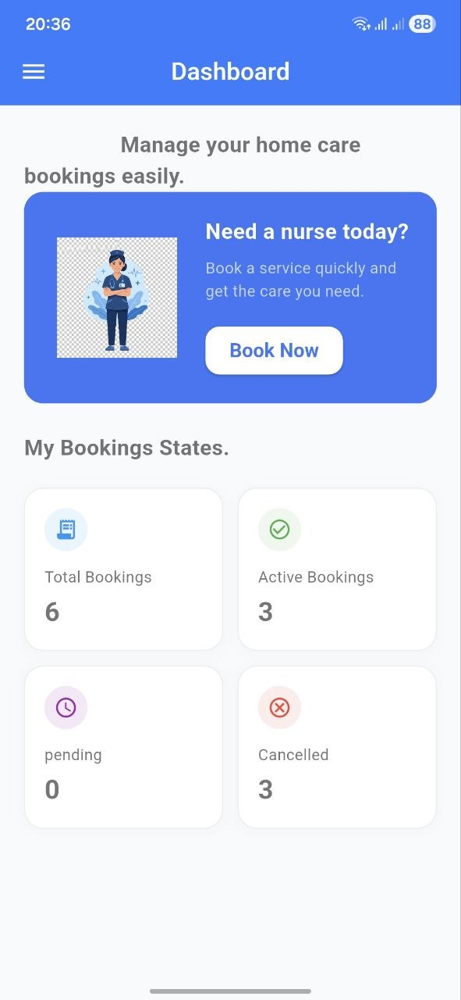
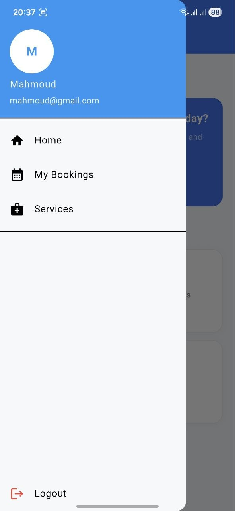
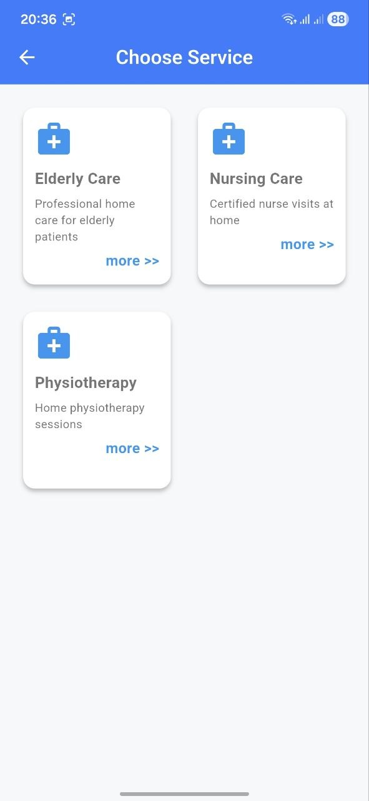
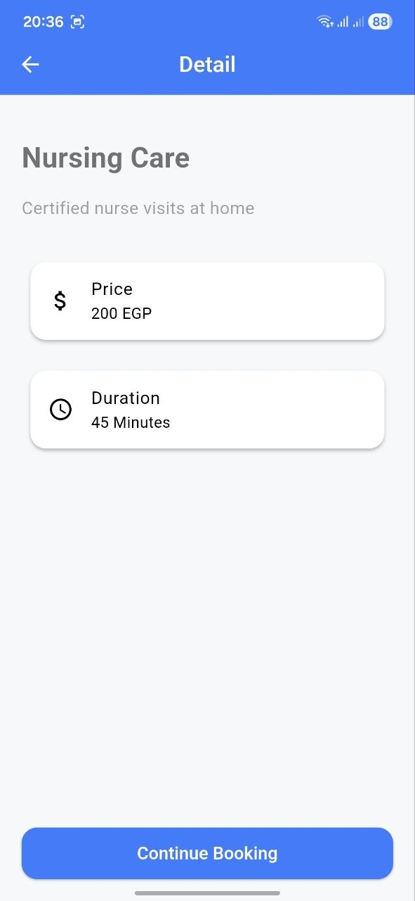
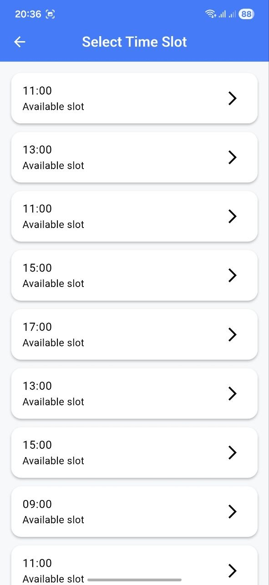
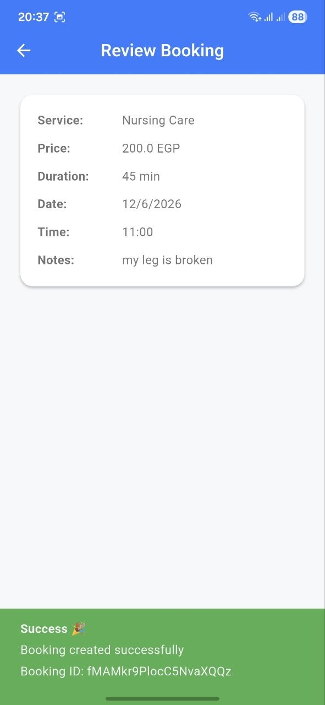
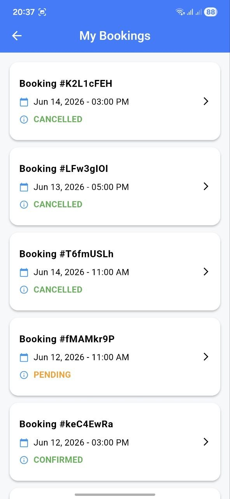
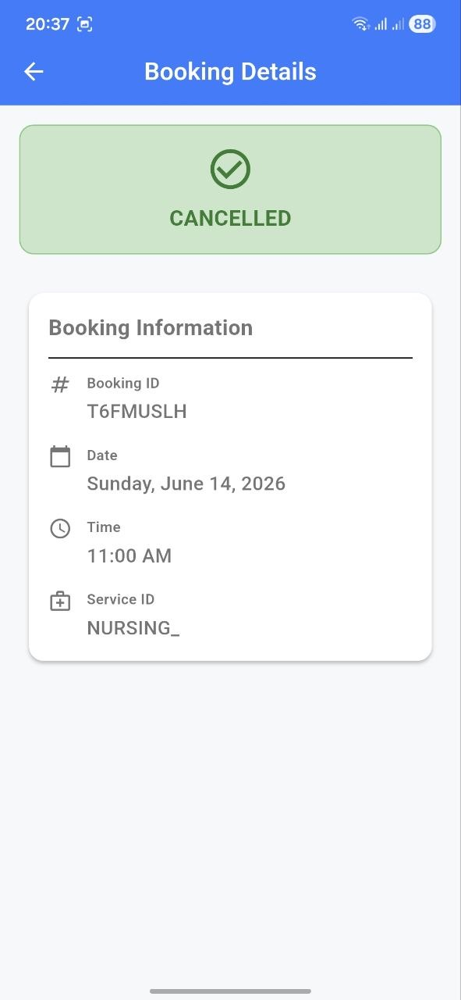

<div align="center">
  

## 🎥 App Demonstration

Check out the full app experience in our demo video:

<div align="center">
  👉 [Watch Demo Video](#) 
  
</div>

# 🩺 Cure Home Care                             

**A beautifully designed, feature-rich Flutter application for home healthcare services.**


[Explore Services](#-features) • [Installation](#-getting-started) • [Architecture](#-architecture) • [Screenshots](#-screenshots)

</div>

---

## 📖 About The Project

**Cure Home Care** is an elegant, full-featured home healthcare service application built with Flutter. Designed with a focus on clean code and scalable architecture, it integrates seamless service booking, provides secure user authentication via **Firebase**, and utilizes robust local caching management using **Hive** and **Firestore**.

With a beautiful UI, smooth animations, and a responsive layout powered by `flutter_screenutil`, Cure Home Care delivers a premium user experience across all devices.

## ✨ Features

- **Authentication System:** Secure email & password registration/login with Firebase Auth.
- **Service Discovery:** Explore various home healthcare services available for booking.
- **Booking Management:** Schedule appointments seamlessly by selecting desired time slots.
- **Real-time Notifications:** Keep up-to-date with your appointments via Firebase Messaging and local notifications.
- **Favorites & Offline Support:** Local caching to ensure a smooth experience using Hive.
- **Modern UI/UX:** A stunning, brand-aligned theme with engaging animations and a responsive layout using `flutter_screenutil`.

## 📱 Screenshots

| Login | Dashboard | App Drawer |
| :---: | :---: | :---: | 
|  |  |  |

| Services | Service Details | Slot Selection |
| :---: | :---: | :---: |
|  |  |  |

| Book Screen | Booked Appointments | Appointment Details |
| :---: | :---: | :---: |
|  |  |  |


## 🏗️ Architecture

Cure Home Care follows the **Clean Architecture** principles, separating concerns into strictly defined layers to ensure maintainability, scalability, and testability. State management is handled robustly using the **BLoC (Business Logic Component)** pattern along with `Freezed` for immutable states.

| Layer | Responsibility |
| :--- | :--- |
| **Domain** | Contains the core business logic: Entities, Use Cases, and Repository Contracts. |
| **Data** | Handles data retrieval: Remote sources (Dio), Local sources (Hive), and Repository Implementations. |
| **Presentation** | UI components: Screens, Widgets, and BLoCs for state management. |

Dependency Injection is centralized and managed via `GetIt`. Routing is efficiently managed using `go_router`.

## 🛠️ Tech Stack

- **Framework:** [Flutter](https://flutter.dev/)
- **Language:** [Dart](https://dart.dev/)
- **State Management:** [flutter_bloc](https://pub.dev/packages/flutter_bloc)
- **Networking:** [Dio](https://pub.dev/packages/dio)
- **Local Storage:** [Hive](https://pub.dev/packages/hive)
- **Backend/Auth:** [Firebase Auth](https://firebase.google.com/products/auth), [Cloud Firestore](https://firebase.google.com/products/firestore) & [Firebase Messaging](https://firebase.google.com/products/cloud-messaging)
- **Routing:** [go_router](https://pub.dev/packages/go_router)
- **Code Generation:** [Freezed](https://pub.dev/packages/freezed) & [JSON Serializable](https://pub.dev/packages/json_serializable)

## 🚀 Getting Started

To get a local copy up and running, follow these simple steps.

### Prerequisites

- [Flutter SDK](https://docs.flutter.dev/get-started/install) (`^3.12.0` or higher)
- A configured [Firebase Project](https://firebase.google.com/)

### Installation

1. **Clone the repository**
   ```bash
   git clone https://github.com/MahmoudAbogamihe/cure_home_care.git
   cd cure_home_care
   ```

2. **Install dependencies**
   ```bash
   flutter pub get
   ```

3. **Configure Firebase**
   - Register your app in your Firebase project.
   - For Android: Place `google-services.json` in `android/app/`.
   - For iOS: Place `GoogleService-Info.plist` in `ios/Runner/`.
   - Alternatively, regenerate `firebase_options.dart`:
     ```bash
     dart pub global activate flutterfire_cli
     flutterfire configure
     ```

4. **Run the App**
   ```bash
   flutter run
   ```

### Code Generation

If you modify or add new Freezed/JSON Serializable classes or Hive type adapters, rebuild the generated files:
```bash
dart run build_runner build --delete-conflicting-outputs
```

## 🔒 Security Notes

- **Never commit** your Firebase server secrets (`google-services.json`, `GoogleService-Info.plist`) to version control.
- It is highly recommended to restrict your Firebase API keys in the Google Cloud Console.

## 📁 Project Structure

```text
lib/
 ├── core/                  # Theme, constants, network layer, shared widgets
 ├── features/              # Features (Auth, Dashboard, Booking, Services, etc.)
 ├── firebase_options.dart  # Generated Firebase config
 ├── injection_container.dart # Dependency injection setup
 └── main.dart              # App entry point
```

## 📜 License

Distributed under the MIT License. See `LICENSE` for more information.

---

<div align="center">
  <b>Built with ❤️ using Flutter</b>
</div>
